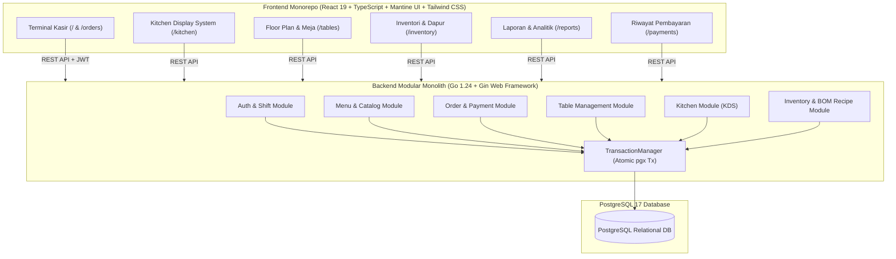
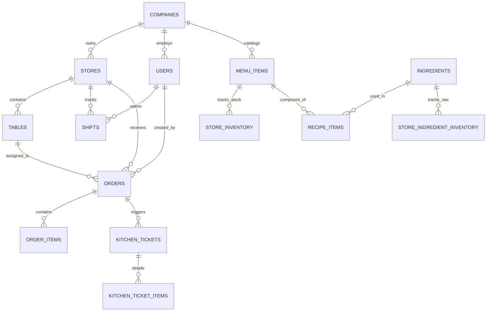
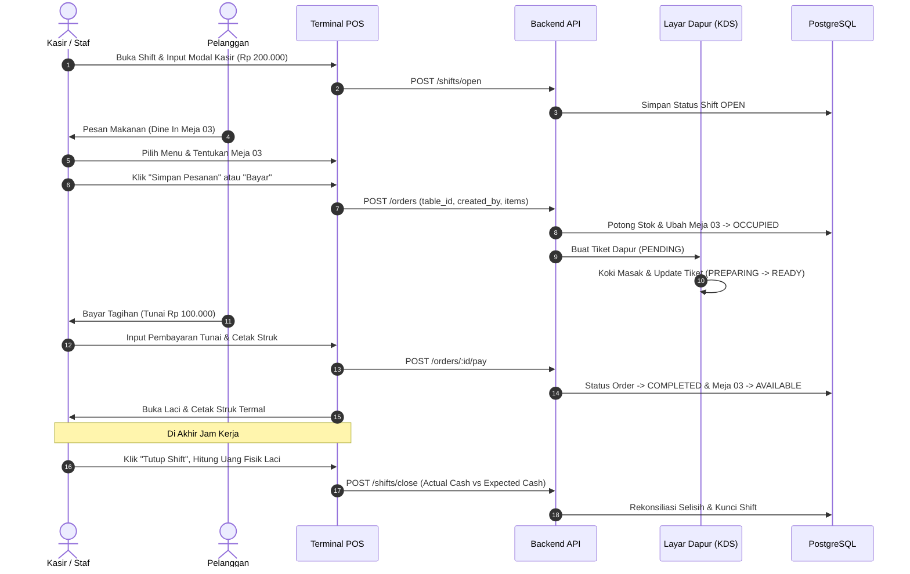

# Dokumentasi Master Sistem: POS Restaurant Platform (Commercial Grade)

Dokumen ini merupakan referensi teknis master dan panduan operasional menyeluruh untuk platform **Restaurant & Cafe Point of Sale (POS)** tingkat komersial berbasis cloud yang dikembangkan dengan arsitektur **Modular Monolith & Pragmatic Domain-Driven Design (DDD)**.

---

## 1. Ringkasan Arsitektur Sistem

Platform ini dirancang khusus untuk industri *Food & Beverage* (F&B) dengan keandalan tinggi (*commercial-grade*), menjamin integritas finansial, audit jejak langkah kasir (*audit trail*), otomatisasi dapur, serta rantai pasok bahan baku ganda (*dual-fulfillment inventory*).



### Prinsip Arsitektur Utama
1. **Backend (Go 1.24)**:
   - **Layering Terisolasi**:
     $$\text{HTTP Handler (REST DTO)} \longrightarrow \text{Application (Use Case)} \longrightarrow \text{Domain Model} \longleftarrow \text{Repository (Infrastructure)}$$
   - **Batas Transaksi Atomik**: Dikelola secara eksplisit di Application Layer menggunakan `TransactionManager.WithinTransaction(...)`. Jika salah satu proses gagal (misal pemotongan stok gagal), seluruh transaksi di-*rollback* tanpa sisa data kotor.
   - **Zero Floating-Point Drift**: Perhitungan moneter menggunakan bilangan bulat `int64` (skala Rupiah) dan tipe data database `NUMERIC(15,2)` serta `NUMERIC(12,4)` untuk takaran resep.
2. **Frontend (React 19 + Vite)**:
   - Monorepo berbasis Turborepo dan `pnpm`.
   - UI Komponen: Mantine UI v7, Tailwind CSS v4, Lucide Icons.
   - State Management: Server Cache terpadu via `@tanstack/react-query` v5 dan Pure Custom Hooks (`useOrderCart`, `useAuth`).
   - Role-Based Access Control (RBAC) dengan *Automatic Route Guarding* dan *Landing Page Redirect*.

---

## 2. Struktur Direktori Proyek

```text
D:\POS\
├── CLAUDE.md                                # Master pedoman arsitektur & konvensi kode
├── DOCUMENTATION.md                         # Dokumentasi master teknis (file ini)
├── docker-compose.yml                       # Konfigurasi container PostgreSQL 17
│
├── backend\                                 # Service Backend (Go 1.24)
│   ├── cmd\api\main.go                      # Entry point server HTTP & graceful shutdown
│   ├── migrations\                          # File migrasi SQL terurut (000001 s.d. 000014)
│   ├── scripts\
│   │   ├── seed_dev.sql                     # Seed data toko, menu, akun staf
│   │   └── supabase_schema.sql              # Skema referensi cloud
│   └── internal\
│       ├── bootstrap\app.go                 # Manual Dependency Injection & Route Wiring
│       ├── config\config.go                 # Environment loader & fallback otomatis
│       ├── database\                        # Pool pgx & TransactionManager
│       ├── auth\                            # Modul Autentikasi, Staf, & Shift Kasir
│       ├── menu\                            # Modul Master Menu & Kategori
│       ├── order\                           # Modul Pesanan, Checkout, & Pembayaran
│       ├── table\                           # Modul Denah Meja & Status Meja
│       ├── kitchen\                         # Modul KDS & Tiket Pesanan Dapur
│       ├── inventory\                       # Modul Stok Jadi & Pemotongan Transaksional
│       ├── ingredient\                      # Modul Master Bahan Mentah & Pembelian
│       ├── recipe\                          # Modul Resep Makanan (Bill of Materials)
│       └── pkg\                             # Utilitas HTTP, JWT, Password Hash, Middleware
│
└── frontend\                                # Workspace Frontend (Turborepo)
    ├── package.json
    ├── pnpm-workspace.yaml
    └── apps\pos\src\                        # Terminal POS Kasir (PWA)
        ├── main.tsx                         # Entry point React, Providers (QueryClient, Auth, Mantine)
        ├── App.tsx                          # Router Coordinator, RBAC Gatekeeper, Global Layout
        ├── config\                          # Navigasi, konstanta, & Company/Store ID dev
        ├── context\AuthContext.tsx          # State pengguna aktif, PIN terminal lock, & Active Shift
        ├── api\client.ts                    # Centralized HTTP API wrappers
        ├── types\pos.ts                     # Definisi tipe domain UI
        └── features\                        # Fitur Modular Berbasis Domain
            ├── auth\                        # Modal Tutup Shift, Layar Kunci PIN, Switch User
            ├── catalog\                     # Grid Menu Produk, Kartu Produk, Filter Kategori
            ├── orders\                      # Panel Keranjang, Ringkasan Pajak, Hold/Recall Orders
            ├── payment\                     # Modal Pembayaran (Cash/QRIS) & Struk Termal
            ├── payments-history\            # Riwayat Pembayaran & Audit Kasir
            ├── tables\                      # Denah Meja Restoran (Visual Floor Plan)
            ├── kitchen\                     # Layar KDS Dapur, Sound FX, Bump Bar
            ├── inventory\                   # Pusat Inventori, Masak Batch, & Resep (BOM)
            └── reports\                     # Dashboard Finansial, Laci Kasir, Audit Kasir
```

---

## 3. Database Schema & Migration Catalog

PostgreSQL berjalan pada host port `5433` (container port `5432`) dengan database `pos`.



### Rincian 14 File Migrasi SQL
1. **`000001_create_companies`**: Tabel tenant multi-perusahaan (`id`, `name`, `tax_id`).
2. **`000002_create_stores`**: Cabang fisik restoran terikat ke `company_id`.
3. **`000003_create_menus`**: Koleksi katalog menu restoran.
4. **`000004_create_menu_categories`**: Kategori menu (`Food`, `Beverages`, `Snacks`, `Desserts`).
5. **`000005_create_menu_items`**: Master produk (`sku`, `name`, `base_price`).
6. **`000006_create_store_menu_items`**: Relasi ketersediaan menu per cabang toko.
7. **`000007_create_menu_category_items`**: Many-to-many kategori dengan menu.
8. **`000008_create_orders`**: Header pesanan dengan status (`DRAFT`, `OPEN`, `COMPLETED`, `CANCELLED`), tipe (`DINE_IN`, `TAKEAWAY`), sumber (`POS`, `QR`), dan `created_by` audit kasir.
9. **`000009_create_order_items`**: Baris snapshot produk pesanan (`quantity`, `unit_price`, `subtotal`, `notes`).
10. **`000010_create_tables`**: Meja restoran (`table_number`, `capacity`, `status`: `AVAILABLE`, `OCCUPIED`, `RESERVED`).
11. **`000011_create_kitchen_tickets`**: Antrean pesanan koki di layar KDS (`status`: `PENDING`, `PREPARING`, `READY`, `SERVED`).
12. **`000012_create_inventory`**: Stok fisik porsi makanan siap saji (`store_inventory`) & buku besar mutasi porsi (`inventory_movements`).
13. **`000013_create_ingredients_and_recipes`**:
    - Master bahan mentah (`ingredients`), unit alami (kg, g, butir, liter), `min_stock_alert`.
    - Stok bahan mentah toko (`store_ingredient_inventory`) dengan toleransi minus untuk operasional tanpa henti.
    - Buku besar audit pemakaian dan belanja bahan mentah (`ingredient_movements`).
    - Resep Bill of Materials (`recipe_items`): Takaran bahan baku per 1 porsi menu.
    - Kolom `fulfillment_type` di `menu_items`: `BATCH_COOKING` vs `MADE_TO_ORDER`.
14. **`000014_create_users_and_shifts`**:
    - Master staf (`users`): nama, PIN terenkripsi bcrypt, dan peran (`OWNER`, `MANAGER`, `CASHIER`, `KITCHEN`).
    - Buku besar shift kasir (`shifts`): modal awal kas kecil, total penjualan kasir, uang fisik laci, dan selisih kas (*discrepancy*).

---

## 4. Modul & Fitur Fungsional End-to-End

### Modul 1: Katalog Menu & Keranjang Kasir (Cart Engine)
- **Katalog Real-time**: Menyajikan daftar menu makanan/minuman dengan indikator stok visual (*badge hijau untuk tersedia, amber jika menipis, merah jika habis*).
- **Proteksi Stok di Keranjang**: Fungsi `addProduct` pada [useOrderCart.ts](file:///d:/POS/frontend/apps/pos/src/features/orders/hooks/useOrderCart.ts) memvalidasi ketersediaan stok; tombol tambah otomatis terkunci jika stok habis, mencegah kasir menjual porsi melebihi ketersediaan.
- **Dukungan Catatan Khusus Per Item**: Kasir dapat menambahkan preferensi tamu (contoh: *"pedas sedang"*, *"tanpa daun bawang"*).
- **Hold & Recall Orders**: Pesanan dapat disimpan sementara (*Hold*) dan dipanggil kembali (*Recall*) saat tamu ingin menambah pesanan atau melakukan pembayaran.

### Modul 2: Manajemen Meja & Denah Restoran (Floor Plan)
- **Layout Visual Meja**: Menampilkan denah tata letak meja makan dengan indikator status:
  - 🟢 **AVAILABLE**: Meja kosong, siap digunakan tamu baru.
  - 🔴 **OCCUPIED**: Sedang ada tamu yang bersantap (terikat ke nomor pesanan aktif).
  - 🟡 **RESERVED**: Meja telah dipesan sebelumnya.
- **Otomatisasi Status**:
  - Saat kasir atau pelanggan membuat pesanan Dine-in dengan memilih meja, backend otomatis mengubah status meja menjadi `OCCUPIED`.
  - Saat kasir menyelesaikan pembayaran tagihan hingga lunas, status meja otomatis kembali menjadi `AVAILABLE`.

### Modul 3: Kitchen Display System (KDS)
- **Layar Koki Interaktif**: Menghilangkan kebutuhan kertas bon dapur manual. Tiket pesanan baru yang dibuat di kasir langsung muncul secara instan di layar koki (`/kitchen`).
- **Live Elapsed Timer & Warna Peringatan**:
  - Hijau: Pesanan baru (< 10 menit).
  - Oranye: Pesanan sedang diproses (10 - 20 menit).
  - Merah: Pesanan mendesak / melebihi target waktu (> 20 menit).
- **Bump Bar Lifecycle**: Koki dapat mengubah status tiket:
  $$\text{PENDING} \longrightarrow \text{PREPARING} \longrightarrow \text{READY} \longrightarrow \text{SERVED}$$
- **Audio Chime FX**: Bunyi notifikasi otomatis berbunyi saat ada pesanan baru yang masuk ke dapur.

### Modul 4: Autentikasi, PIN Terminal Lock & Hak Akses (RBAC)
Sistem memiliki 4 peran pengguna dengan batasan akses ketat:
1. **OWNER**: Akses penuh ke seluruh menu, laporan keuangan, pengaturan inventori, dan manajemen staf.
2. **MANAGER**: Akses ke kasir, operasional inventori, meja, dan rekapitulasi shift.
3. **CASHIER**: Dibatasi hanya pada terminal kasir (`/`), pemilihan meja, dan penutupan shift kasir miliknya.
4. **KITCHEN**: Terisolasi khusus pada layar Kitchen Display System (`/kitchen`). Akses ke rute kasir, laporan, atau pengaturan otomatis diblokir dan dialihkan kembali (*route guard*).
- **PIN Terminal Quick Lock**: Kasir dapat mengunci layar kasir dalam 1 klik saat meninggalkan meja kasir. Pembukaan kunci membutuhkan 4-6 digit PIN staf.

### Modul 5: Manajemen Shift Kasir & Rekonsiliasi Uang Fisik Laci
Mencegah terjadinya kebocoran kasir (*cash shrinkage*) melalui pencatatan shift yang ketat:
- **Buka Shift**: Kasir mencatat modal uang kembalian awal (*cash float / starting cash*).
- **Multi-Condition Shift Reconciliation**:
  Saat tutup shift, sistem hanya menghitung uang tunai dari transaksi yang:
  1. Metode bayar adalah `CASH`.
  2. Waktu transaksi $\ge$ `opened_at` shift yang aktif saat ini.
  3. Transaksi dicatat oleh kasir yang bersangkutan (`order.created_by === activeShift.user_id`).
- **Rumus Audit Laci Kasir**:
  $$\text{Expected Drawer Cash} = \text{Starting Cash} + \text{Total Cash Sales}$$
- **Deteksi Selisih Kas (*Discrepancy*)**: Kasir memasukkan uang fisik hasil hitung manual (*Actual Cash*). Jika berbeda dari sistem, muncul peringatan selisih kas (Kurang/Lebih) yang tercatat permanen di audit database.

### Modul 6: Dual-Fulfillment Inventory & Rantai Pasok Resep (BOM)
Platform membedakan penanganan inventori menjadi dua jalur industri F&B:

#### A. Batch Cooking (Masak di Awal)
*   Digunakan untuk menu yang dimasak dalam kuali/dandang besar (contoh: Rendang, Sayur Sop, Nasi Uduk).
*   Koki menggunakan tombol **+ Masak** di halaman inventori untuk mengonversi bahan baku menjadi porsi jadi.
*   Bahan baku dipotong saat koki memasak, dan porsi jadi bertambah di `store_inventory`.
*   Saat kasir menjual menu ini, stok porsi makanan jadi dipotong langsung.

#### B. Made-to-Order (Dibuat Sesuai Pesanan)
*   Digunakan untuk makanan/minuman yang diracik langsung saat pesanan masuk (contoh: Kopi Latte, Steak, Nasi Goreng).
*   **Tidak memiliki stok porsi jadi fisik di etalase**.
*   **Virtual Stock Engine**: Stok porsi yang terlihat di katalog kasir dihitung secara dinamis dan *real-time* dari bahan baku paling kritis (*bottleneck ingredient*):
    $$\text{Porsi Tersedia} = \min_{i \in \text{Resep}} \left( \left\lfloor \frac{\text{Stok Bahan Baku}_i}{\text{Takaran per Porsi}_i} \right\rfloor \right)$$
*   Saat kasir menyelesaikan penjualan, backend memotong kuantitas bahan baku langsung dari `store_ingredient_inventory` dan mencatat mutasi `SALE` di `ingredient_movements`.
*   Tombol `+ Masak` ditiadakan di UI untuk menu Made-to-Order, dan backend menolak penyesuaian manual demi menjaga validitas akuntansi stok.

#### C. Gudang Bahan Mentah & Belanja Bahan
*   Mendukung satuan alami tanpa paksaan (*kg, gram, liter, butir, lembar*).
*   Fitur **+ Belanja**: Kasir/manajer mencatat belanja bahan masuk dari supplier/pasar, yang seketika menaikkan stok porsi menu Made-to-Order secara otomatis.
*   Toleransi minus (*Opsi B*): Operasional kasir tidak terhenti jika stok bahan baku belum sempat di-input kasir saat supplier tiba.

### Modul 7: Riwayat Pembayaran & Struk Kasir Termal
- **Thermal Print Formatting**: Tampilan struk kasir yang dioptimalkan untuk printer termal standar (58mm / 80mm).
- **Anti-Misattribution**: Mencetak nama kasir pembuat order asli saat reprint dari riwayat transaksi, menghindari kesalahan atribusi saat pergantian shift.
- **Rincian Pembayaran**: Menyajikan subtotal, diskon, pajak 10%, metode pembayaran (CASH/QRIS/DEBIT), uang diterima, dan kembalian.

### Modul 8: Laporan Finansial & Audit Performa Kasir
- **Segregasi Kas vs Non-Tunai**: Memisahkan pendapatan uang fisik tunai dengan pendapatan digital (QRIS, Transfer, EDC) agar pencocokan setoran bank tidak rancu.
- **Cashier Performance Ranking**: Tabel performa staf yang meranking kasir berdasarkan kontribusi nominal omzet dan jumlah pesanan yang dilayani.
- **Visual KPI Ringkas**: Menampilkan Penjualan Kotor (*Gross Sales*), Penjualan Bersih (*Net Sales*), Total Transaksi, dan *Average Order Value (AOV)*.

---

## 5. Referensi Lengkap REST API

Base URL: `http://localhost:8080/api/v1`

### A. Autentikasi & Shift Kasir
| Method | Endpoint | Deskripsi |
| :--- | :--- | :--- |
| `POST` | `/auth/login` | Login menggunakan username dan password |
| `POST` | `/auth/unlock` | Buka kunci terminal menggunakan PIN cepat staf |
| `GET` | `/staff` | Mengambil daftar staf toko untuk pemetaan nama kasir |
| `POST` | `/shifts/open` | Membuka shift baru dengan mencatat uang modal kasir |
| `GET` | `/shifts/active` | Mengambil shift aktif kasir saat ini |
| `POST` | `/shifts/close` | Menutup shift, mencatat uang fisik laci, dan audit selisih |

### B. Menu & Katalog
| Method | Endpoint | Deskripsi |
| :--- | :--- | :--- |
| `GET` | `/menu-items` | Mengambil katalog menu aktif beserta sisa stok porsi |
| `POST` | `/menu-items` | Menambahkan menu baru (mendukung penentuan tipe pemenuhan) |
| `DELETE` | `/menu-items/:id` | Menonaktifkan (*soft delete*) menu dari katalog kasir |
| `GET` | `/menu-categories` | Mengambil seluruh daftar kategori menu |

### C. Pesanan & Pembayaran (Order & Checkout)
| Method | Endpoint | Deskripsi |
| :--- | :--- | :--- |
| `POST` | `/orders` | Membuat pesanan baru (`DINE_IN`/`TAKEAWAY`, `POS`/`QR`, `created_by`) |
| `GET` | `/orders` | Mengambil riwayat dan antrean pesanan (`status=OPEN`, `COMPLETED`) |
| `GET` | `/orders/:id` | Mengambil detail lengkap 1 pesanan beserta rincian item |
| `POST` | `/orders/:id/pay` | Memproses pembayaran (CASH/QRIS), menghitung kembalian, lunas |
| `DELETE` | `/orders/:id` | Membatalkan/menghapus pesanan tersimpan (*Hold Order*) |

### D. Manajemen Meja Restoran
| Method | Endpoint | Deskripsi |
| :--- | :--- | :--- |
| `GET` | `/tables` | Mengambil denah seluruh meja beserta status keterisiannya |
| `PATCH`| `/tables/:id/status`| Mengubah status meja (`AVAILABLE`, `OCCUPIED`, `RESERVED`) |

### E. Kitchen Display System (KDS)
| Method | Endpoint | Deskripsi |
| :--- | :--- | :--- |
| `GET` | `/kitchen/tickets` | Mengambil antrean tiket pesanan dapur yang belum selesai |
| `PATCH`| `/kitchen/tickets/:id/status`| Mengubah status pengerjaan tiket koki (`PREPARING`, `READY`, `SERVED`) |
| `POST` | `/kitchen/batch-produce` | Koki memasak batch (potong bahan baku $\rightarrow$ tambah stok jadi) |

### F. Inventori, Bahan Mentah & Resep (BOM)
| Method | Endpoint | Deskripsi |
| :--- | :--- | :--- |
| `GET` | `/ingredients` | Mengambil master dan stok fisik bahan mentah gudang |
| `POST` | `/ingredients` | Mendaftarkan master bahan baku baru |
| `PUT`  | `/ingredients/:id` | Memperbarui nama, kode, unit, atau batas peringatan stok |
| `DELETE`| `/ingredients/:id`| Menghapus bahan baku dan relasi resepnya |
| `POST` | `/ingredients/restock` | Mencatat belanja bahan baku mentah dari supplier |
| `GET` | `/recipes/:menuItemId` | Mengambil komposisi takaran resep untuk 1 porsi menu |
| `POST` | `/recipes/:menuItemId` | Menyimpan/memperbarui resep BOM untuk menu |

---

## 6. Standar Prosedur Operasional Kasir (SOP Kasir)



1. **Awal Hari (Buka Shift)**:
   - Kasir membuka aplikasi kasir $\rightarrow$ Layar meminta input modal uang kembalian awal (*starting cash*).
   - Kasir memasukkan nominal uang fisik yang ada di dalam laci, lalu menekan **Buka Shift**.
2. **Transaksi Dine-In (Makan di Tempat)**:
   - Kasir memilih meja yang berstatus kosong (hijau).
   - Memilih menu makanan dan minuman sesuai pesanan tamu.
   - Menekan **Save Order** jika tamu bayar belakangan (tiket langsung masuk ke KDS dapur dan meja berubah merah/OCCUPIED), atau langsung menekan **PAY** jika bayar di muka.
3. **Pelunasan & Cetak Struk**:
   - Kasir membuka pesanan tersimpan di meja tersebut $\rightarrow$ Klik **Load to Checkout**.
   - Pilih metode bayar (**CASH** dengan tombol pecahan cepat atau **QRIS**).
   - Struk termal tercetak otomatis dan meja kembali hijau (AVAILABLE).
4. **Akhir Hari (Tutup Shift & Rekonsiliasi Laci Kasir)**:
   - Kasir menekan menu profil $\rightarrow$ **Tutup Shift Kasir**.
   - Kasir menghitung fisik seluruh lembaran uang di laci tanpa melihat angka tebakan.
   - Memasukkan angka fisik ke kolom **Uang Fisik Kasir (Hasil Hitung Manual)**.
   - Sistem mencocokkan dengan uang yang seharusnya ada. Jika sesuai (*Selisih Rp 0*), kasir menekan **Konfirmasi & Tutup Shift**.

---

## 7. Panduan Menjalankan Sistem & Pengujian

### Prasyarat Perangkat Lunak
- **Docker Engine & Docker Compose** (untuk database PostgreSQL 17).
- **Go 1.24+** terinstal dan terdaftar di `PATH`.
- **Node.js 20+** dan package manager **pnpm** (`npm install -g pnpm`).

### 1. Menjalankan Database PostgreSQL
```powershell
cd D:\POS\backend
docker compose up -d
```
*Port database lokal terhubung di `localhost:5433`.*

### 2. Menjalankan Backend Go API
```powershell
cd D:\POS\backend
go run cmd/api/main.go
```
*Server API aktif dan melayani request di `http://localhost:8080`.*

### 3. Menjalankan Frontend Web Kasir
```powershell
cd D:\POS\frontend
pnpm --filter pos dev
```
*Terminal kasir dapat dibuka melalui browser di `http://localhost:5173`.*

### 4. Menjalankan Validasi & Pengujian Otomatis
*   **Uji Unit Backend (Go)**:
    ```powershell
    cd D:\POS\backend
    go test ./internal/order/...
    go test ./internal/kitchen/...
    go test ./internal/inventory/...
    ```
*   **Uji Tipe & Build Frontend (TypeScript & Vite)**:
    ```powershell
    cd D:\POS\frontend
    pnpm --filter pos build
    ```
